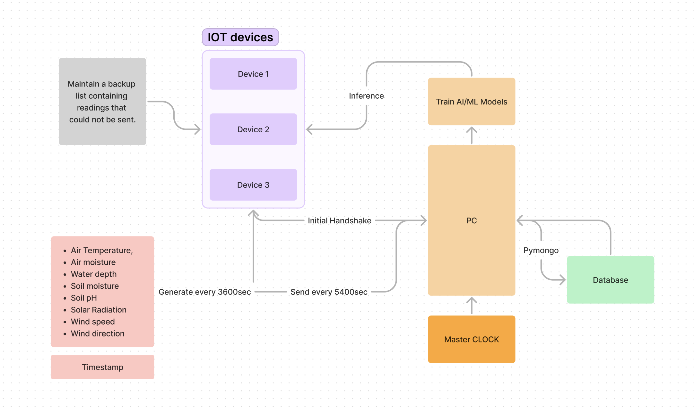

# DA353 (IoT) Lab Major Assignment 

## Group 2 (Work Distribution)
- Aditya Gupta (210150002)
    - Time Sync (PC and device)
    - Device UID / Addition of new devices
    - Device failure protocols
- Nishchay Nilabh (210150013)
    - Initial Handshake
    - Device changes upon receiving inference
    - Sending/Downloading data from MongoDB
- Subhash Patel (210150017)
    - Data generation
    - Training AI/ML model
    - Generating inference

<hr>
<br>

<p><em>Figure : Flowchart showing the overview of the entire process.</em></p>


## Code

- ```central.ipynb``` : Contains code for the PC client that is responsible for all the tasks that occur more frequently or require higher computational power.
    - Check for new devices
    - Check for failures and respond accordingly.
    - Upload/Fetch data from MongoDB.
    - Getting inference from AI models.
    - Update / Sync master clock from NTP protocols.


- ```temp.py``` : Micropython code that executes on ESP32 device. Spends major time sleeping and performs lightweight tasks.
     - Send sensor data.
     - Check for PC failure.
     - Store backup locally
     - Display inferences from AI models.


